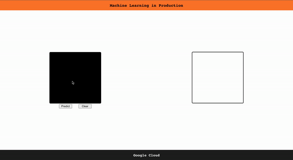

React Digit Recognition App hosted in Google Cloud

Frontend:
- React

Backend:
- python, flask

ML:
- tensorflow, jupyter notebook, mnist digits 

Deployment: 
- Google storage (the model weights were stored in a bucket)
- Google Functions (prediction)
- Google App Engine (deploying the frontend)

References: 
- bucket: 
    https://medium.com/wesionary-team/create-a-bucket-in-google-cloud-platform-and-make-its-objects-publicly-available-bdd01b6fd6a7
- hosting/serving the model:
    https://towardsdatascience.com/machine-learning-in-production-95e1999bba84
    https://cloud.google.com/blog/products/ai-machine-learning/how-to-serve-deep-learning-models-using-tensorflow-2-0-with-cloud-functions
- app engine deploy: 
    https://javascript.plainenglish.io/quickly-deploy-your-react-app-on-googles-app-engine-6bb97480cc9c